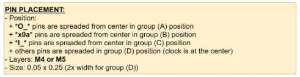
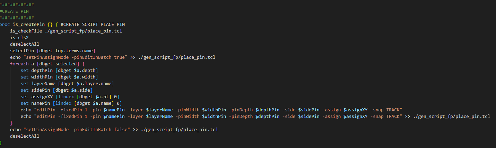
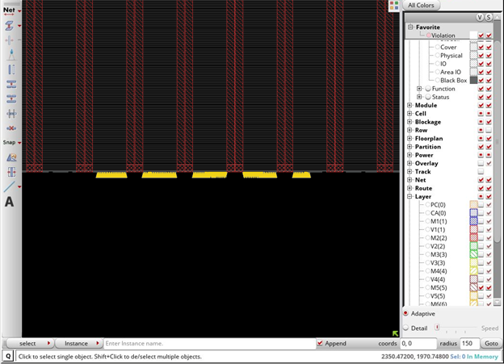
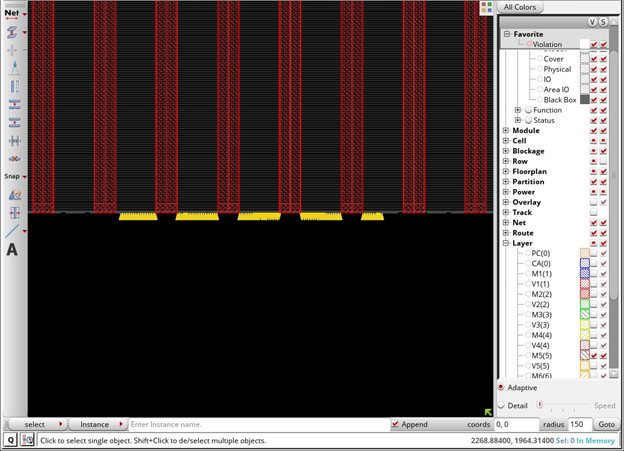

# Innovus_Script_Auto_Tool
[TCL] - PNR - Innovus 

PlacePinShape : Đặt pin cho shape cần thiết kế 

# Documentation
* [Create Place Pin](#createPin)
* [Vấn đề khi thiết kế power mesh và phân bố pin](#howToPlacePin)

## Create Place Pin
 

1. group A gồm các pin *O_*
2. group B gồm các pin *x0a*
3. group C gồm các pin *I_*
4. group D các chân còn lại (Chứa các chân clk) 

Yêu cầu đặt pin ở layer M4 hoặc M5 

Size Depth: 0.25 width: 0.05 (Nhân 2 cho with ở group D) 

### Tạo script Place Pin
 

## Vấn đề khi thiết kế power mesh và phân bố pin
### Config cho Power Mesh
1. Quy tắc tạo layer power mesh trên shape với layer M1 và M2 tạo rail với dạng chạy ngang, từ M3 trở lên dựa vào quy tắc số lẻ chạy dọc số chẳn chạy ngang. Dựa vào việc config đường power trong PowerMesh. 

2. Khi đặt pin ở một số layer, pin bị trùng trên đường power. Điều này cần tránh vì đường routing cho pin sẻ đi vòng làm cho routing resource tắt nghẽn nên cần phân bố đồng đều tránh đường power tạo không gian cho route pin di chuyển thỏa mái hơn 

3. Một số yêu cầu đặt pin tại layer top tức M5 nơi cấp nguồn cho mem, khi đường power có opt (-extend_to design_boundary) tức cho đường chạy từ core ra die, khi ta đặt pin ở những vị trí này tool tự động cắt xén đường power làm mất đặt tính config.

Setup đường power M5
>=============================================

> CREATE M5 POWER MESH 20%

>=============================================

>set   width    [expr 4.5]

>set   spacing  [expr 0.5]

>addStripe \

>-nets                            {VDD VSS} \

>-layer                           M5 \

>-direction                       Vertical \

>-width                           $width \

>-spacing                         $spacing \

>-stacked_via_top_layer           M6 \

>-stacked_via_bottom_layer        M4 \

>-create_pins                     1 \

>-start_offset                    0 \

>-set_to_set_distance             30 \

>-extend_to                       design_boundary

Hình ảnh cho layer M5:

 

### Phương pháp giải quyết 

Trong innovusTCR có function createPinBlk tạo các block không cho pin đặt vào, dựa vào tính năng này ta kết hợp dbShape để vẻ vỏ bọc cho power mesh M5 và ta chọn lại vị trí rãi pin, khi tool rãi nó tự né khu vực powermesh này 

 

>proc is_createPinBlkPower {} {

>    foreach a [dbShape [dbget [dbget top.pgNets.sWires.layer.name -regexp M5 -p2].box] SIZEX 0.5] {

>        echo "createPinBlkg -area {$a} -cell [dbget top.name] -layer {M5}" >> ./gen_script_fp/testBlkPin.tcl 
 
>    }

>}

Giải thích lệnh: 

