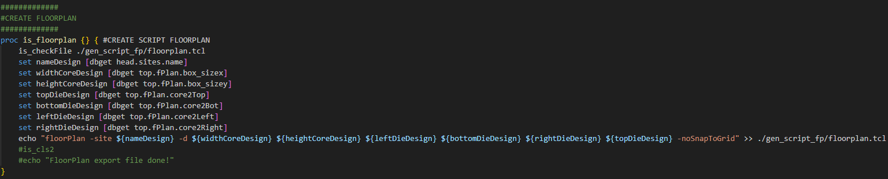
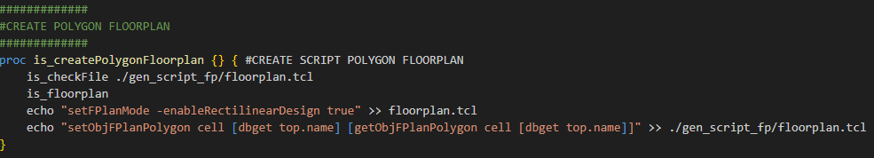

# Innovus_Script_Auto_Tool
[TCL] - PNR - Innovus 

autoTool : init run Innovus 

## Định nghĩa trong file .cshrc
 

> alias runInnovus 'setenv LM_LICENSE_FILE 5280@msoca-ls1 ; /tools/cadence/Innovus_21.15.000/bin/innovus  -64 -win -init ~/autoTool/autoTool.tcl -log ./innovus_logs/innovus.log -wait 120' 

## Hàm quan trọng trong việc FloorPlan

### Tạo script Shape FloorPlan
 

B1: Tạo hình dạng shape thông qua GUI <space><space>
B2: chạy hàm để tạo script của shape <space><space>
Tạo script shape với hình dạng hình bình hành cơ bản gồm: hình vuông và hình chữ nhật ghi vào file <space><space>

### Tạo script Shape FloorPlan Polygon
 

B1: Tạo hình dạng shape từ hình bình hành trước đó sau đó tạo hình polygon thông qua GUI <space><space>
B2: chạy hàm để tạo script của shape <space><space>
Tạo script shape với hình dạng polygon ghi vào file <space><space>

