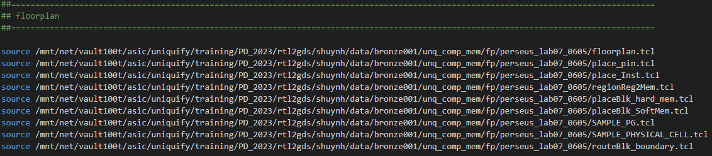
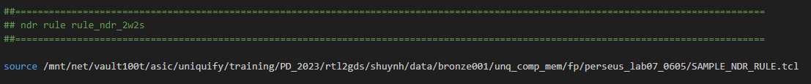
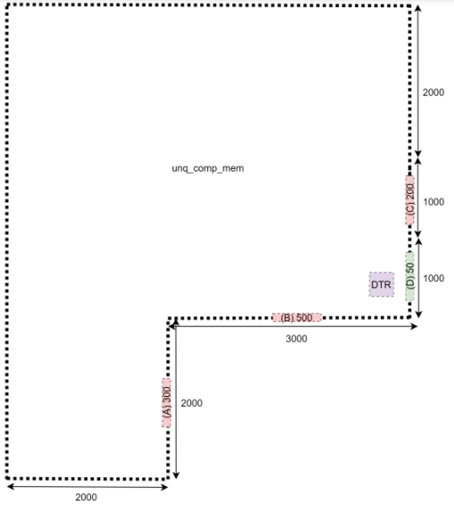
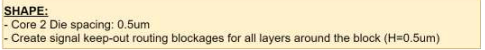
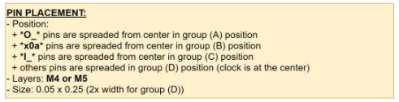
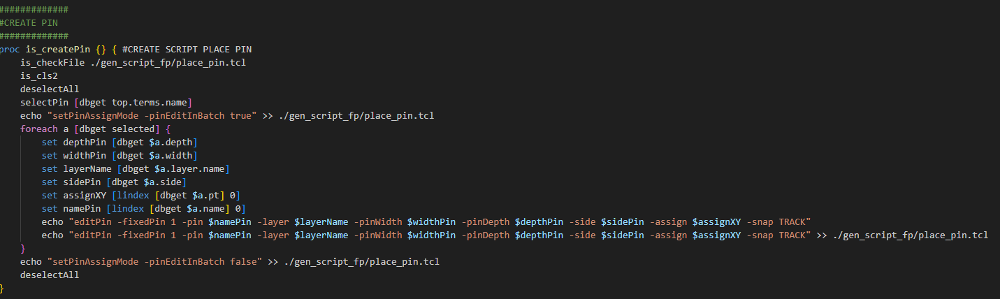

# Innovus_Script_Auto_Tool
[TCL] - PNR - Innovus 

autoTool : init run Innovus 

## Định nghĩa trong file .cshrc
 

> alias runInnovus 'setenv LM_LICENSE_FILE 5280@msoca-ls1 ; /tools/cadence/Innovus_21.15.000/bin/innovus  -64 -win -init ~/autoTool/autoTool.tcl -log ./innovus_logs/innovus.log -wait 120' 

# Hàm quan trọng trong việc FloorPlan

## Từng bước FloorPlan:
 

1. Create Shape FloorPlan (Tạo hình dạng)
2. Place pin for shape (Đặt pin cho shape)
3. Place Memory (Sắp xếp mem trên Shape)
4. Place region Reg2Mem (Gom nhóm và đặt khu vực các FF giao tiếp với Memory)
5. Place Hard Block Ages (Đặt hard blk ngăn chặn std cell đi vào)
6. Place Soft Block Ages (Đặt soft blk không cho std cell đi vào nhưng những con drv được phép đi vào)
7. Power Mesh (Thiết kế cho đường power ở các layer phù hợp đãm bảo các vấn đề EM)
8. Place Physical cell (Đặt WellTap EndCap vào các đường biên và phân bố đều trên shape)
9. Route Blk Boundary (Tạo route block ngoài biên để tránh tool route vào những khu vực này)

 

10. Thiết đặt rule cho đường clock và signal

## Create Shape
### Mẫu yêu thiết kế hình dạng
 

 

1. Yêu cầu Core2Die 0.5um
2. Tạo routeBlkage từ die2core 0.5um

### Tạo script Shape FloorPlan
 

B1: Tạo hình dạng shape thông qua GUI 

B2: chạy hàm để tạo script của shape 

Tạo script shape với hình dạng hình bình hành cơ bản gồm: hình vuông và hình chữ nhật ghi vào file 

### Tạo script Shape FloorPlan Polygon
 

B1: Tạo hình dạng shape từ hình bình hành trước đó sau đó tạo hình polygon thông qua GUI 

B2: chạy hàm để tạo script của shape 

Tạo script shape với hình dạng polygon ghi vào file 

## Create Place Pin
 

1. group A gồm các pin *O_*
2. group B gồm các pin *x0a*
3. group C gồm các pin *I_*
4. group D các chân còn lại (Chứa các chân clk)
Yêu cầu đặt pin ở layer M4 hoặc M5 

Size Depth: 0.25 width: 0.05 (Nhân 2 cho with ở group D) 

### Tạo script Place Pin
 
